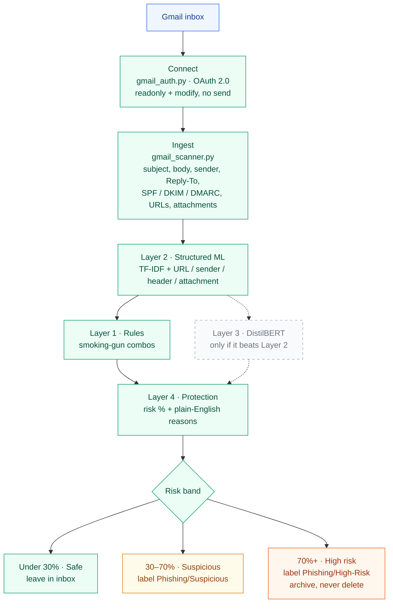

# Gmail Phishing Detector

A second layer behind Gmail’s own filters. It trains offline on labeled
email fields, scores phishing risk with an explainable model, and can
apply recoverable Gmail labels. It never deletes mail and never sends mail.

## Architecture

Solid boxes are built. Dashed boxes are planned.



| Layer | Role | Status |
|-------|------|--------|
| 1 · Rules | High-precision combos (IP + credentials, lookalike + auth fail, …) | **Built** |
| 2 · Structured ML | TF-IDF + structured signals; trains LR / Forest / XGBoost | **Built** |
| 3 · Transformer | DistilBERT only if it beats Layer 2 on a real inbox | Planned |
| 4 · Protection | Explainable score and Gmail labels / archive | **Built** |

## Structure

```
gmail-phishing-model/
├── data/
│   ├── phishing_legit_dataset_KD_10000.csv  # your 10k labeled set (default)
│   ├── emails.csv                           # structured URL/auth extras
│   └── sample_emails.csv                    # 16-row walkthrough set
├── models/                     # written by train_model.py
│   ├── phishing_model.joblib
│   ├── feature_builder.joblib
│   └── metrics.json
├── src/
│   ├── feature_engineering.py
│   ├── rules.py                # Layer 1
│   ├── train_model.py
│   ├── predict.py
│   ├── generate_dataset.py
│   ├── gmail_auth.py
│   └── gmail_scanner.py
├── tests/
│   └── test_features.py
└── requirements.txt
```

## Quickstart

```bash
python3 -m venv .venv
source .venv/bin/activate
pip install -r requirements.txt

# Train on the 10k dataset in data/ (default)
python src/train_model.py

# Or train only on the smaller structured set
python src/train_model.py --data data/emails.csv

# Score the built-in phishing demo
python src/predict.py

# Score a legitimate-looking message
python src/predict.py \
  --subject "Lunch tomorrow?" \
  --body "Want to grab tacos at 12:30?" \
  --sender "priya@acme.com" \
  --spf pass --dkim pass --dmarc pass --urls ""

# Score every row in a CSV
python src/predict.py --csv data/emails.csv

python -m unittest tests/test_features.py
```

## Dataset

Training prefers files in this order:

1. `data/phishing_legit_dataset_KD_10000.csv` — **your uploaded 10k set**
   (6,000 phishing / 4,000 legitimate). Columns: `text`, `label`,
   `phishing_type`, `severity`, `confidence`.
2. `data/emails.csv` — smaller structured set with URLs, senders, and
   SPF/DKIM/DMARC (from `python src/generate_dataset.py`).
3. `data/sample_emails.csv` — 16-row walkthrough.

The 10k file is text-only. The loader splits a leading `Subject:` into
subject/body and **strips annotator `Keywords:` lines** (every phishing
row had one; no legitimate row did). Training also mixes in
`data/emails.csv` so URL / sender / auth examples exist. Layer 1 still
raises risk at score time for those flags.

## Current model

Trained on **10,129 rows** (10k uploaded + 129 structured). Winner:
**logistic regression** (all three models tie on ROC-AUC; LR is kept for
calibration).

| Metric | Hold-out |
|--------|----------|
| ROC-AUC | 1.000 |
| Precision / recall / F1 | ~1.000 (one miss among ~2,000 hold-out rows) |

Treat 1.000 as a corpus result. These emails are templated. Always
`--dry-run` on a real inbox.

## Scoring

`predict.py` combines three things:

1. The trained classifier probability
2. A one-way boost from high-precision URL / sender / auth / attachment flags
3. Layer 1 rule floors when smoking-gun combos fire

Output uses the same bands as the Gmail scanner:

| Risk | Band | Gmail action (`--live`) |
|------|------|-------------------------|
| < 30% | SAFE | None |
| 30–70% | SUSPICIOUS | `Phishing/Suspicious`, stays in inbox |
| ≥ 70% | HIGH RISK | `Phishing/High-Risk`, archived |

```
PHISHING RISK: 100.0%  [HIGH RISK]  (phishing)
Reasons:
  ✓ Uses urgent / threatening language
  ✓ Asks for passwords or other credentials
  ✓ Link uses a raw IP address instead of a domain
  ✓ Sender domain lookalike of a well-known brand
  ✓ Rule: credential request plus a raw-IP link
```

## Gmail integration

Create an OAuth desktop client in Google Cloud Console, enable the Gmail
API, and save `credentials.json` in the project root. First run opens a
browser. Scopes are read + label only — no send.

```bash
# Always start here
python src/gmail_scanner.py --max_results 20 --dry-run

python src/gmail_scanner.py --max_results 20 --live
python src/gmail_scanner.py --query "in:inbox is:unread" --dry-run --json
```

Dry-run does not create labels or change mail. High-risk mail is archived,
never deleted. Do not turn off Gmail’s built-in phishing protection.

## What the features catch

| Category | Signals |
|----------|---------|
| Text | urgency, credential asks, ALL-CAPS, exclamation density |
| URL | raw IP, suspicious TLD, shortener, `@` obfuscation, punycode, HTTP login |
| Sender | brand lookalikes, hyphenated domains, digit substitution, display-name spoof |
| Headers | SPF / DKIM / DMARC fail, Reply-To mismatch |
| Attachments | risky extensions (`.exe`, `.docm`, `.js`, …) |

## Limits

- This is a second layer, not a replacement for Gmail’s filters.
- The bundled emails are synthetic. Hold-out scores on them will look
  strong; a real inbox will be messier. Always `--dry-run` first.
- False positives are costly, which is why high-risk mail is archived
  rather than deleted.
- One user’s OAuth grant covers only that mailbox.

## Next

1. Fine-tune DistilBERT only if it beats this model on **your** inbox.
2. Log user corrections (phishing / not phishing) and retrain.
3. For push protection, wire Gmail `watch()` + Pub/Sub instead of a
   manual scan.
