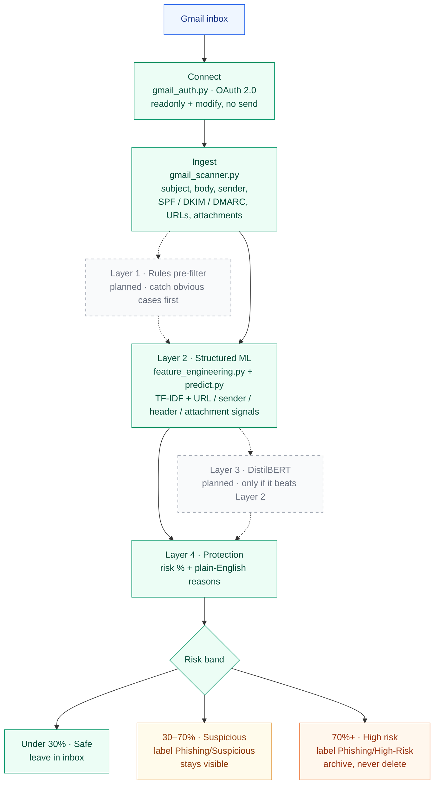
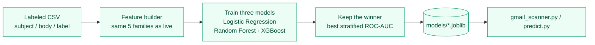

# Gmail Phishing Detector — ML Pipeline (Layer 2 & 4)

Offline training is Gmail-agnostic — a labeled CSV of email fields is enough
to fit the model. After that, `gmail_scanner.py` can score a live inbox and
apply protective labels. Layer 1 (rules) and Layer 3 (BERT) are still future
work.

## Architecture

This is a **second layer behind Gmail’s own filters**, not a replacement.
It reads mail, scores phishing risk, and applies recoverable labels. It
never deletes messages and never sends mail (OAuth is read + label only).

Solid boxes are built. Dashed boxes are planned.



Training is a separate offline path. The live scanner loads the artifacts
this produces; it does not train against Gmail.



| Layer | Role | Status |
|-------|------|--------|
| 1 · Rules | Cheap pre-filter before the model runs | Planned |
| 2 · Structured ML | TF-IDF + structured signals; trains LR / Forest / XGBoost | **Built** |
| 3 · Transformer | Fine-tuned DistilBERT once a few thousand labeled rows exist | Planned |
| 4 · Protection | Explainable score and Gmail labels / archive | **Built** |

## Structure

```
phishing_detector/
├── data/
│   └── sample_emails.csv       # 16-row toy dataset, replace with real data
├── models/                     # created after training
│   ├── phishing_model.joblib
│   └── feature_builder.joblib
├── src/
│   ├── feature_engineering.py  # text, URL, sender, header, attachment features
│   ├── train_model.py          # trains LR / RandomForest / XGBoost, picks best
│   ├── predict.py              # loads model, scores an email, explains why
│   ├── gmail_auth.py           # OAuth (read + label only)
│   └── gmail_scanner.py        # live inbox scoring and protective labels
└── requirements.txt
```

## Quickstart

```bash
python3 -m venv .venv
source .venv/bin/activate
pip install -r requirements.txt

# Train (swap in your own labeled CSV once you have one)
python src/train_model.py --data data/sample_emails.csv

# Score a single email
python src/predict.py
```

## Getting a real dataset

The sample CSV is just 16 rows so you can see the pipeline run — it's not
enough data to actually train a generalizable model. For a real version:

- **Kaggle**: search "phishing email dataset" — several public sets with
  10k+ labeled emails (subject/body + label) exist.
- **Nazario phishing corpus** + a legit-email corpus (e.g. Enron dataset)
  as your two classes.
- **Your own Gmail**: once the Gmail API integration is built, you can
  bootstrap by labeling a batch of your own inbox + spam folder emails.

Match your CSV's columns to what `feature_engineering.py` expects (see the
docstring at the top of that file) — at minimum `subject`, `body`, `label`;
add `sender`, `urls`, `spf`/`dkim`/`dmarc`, `num_attachments`,
`attachment_types` for the full feature set.

## What each feature category catches

| Category   | Signals |
|------------|---------|
| Text       | urgency language, credential-request phrasing, all-caps, exclamation density |
| URL        | IP-address links, suspicious TLDs, shorteners, `@` obfuscation, dot count |
| Sender     | brand lookalikes (`paypa1` vs `paypal`), hyphenated domains, digit substitution |
| Headers    | SPF/DKIM/DMARC pass/fail |
| Attachments| risky extensions (.exe, .scr, .docm, etc.) |

`predict.py` maps each triggered signal to a plain-English reason, so output
looks like:

```
PHISHING RISK: 94.9% (phishing)
Reasons:
  ✓ Uses urgent / threatening language
  ✓ Link uses a raw IP address instead of a domain
  ✓ Fails SPF/DKIM/DMARC authentication
  ...
```

## Protection layer (Gmail integration)

`src/gmail_auth.py` and `src/gmail_scanner.py` connect this to a live Gmail
account and *act* on the risk score, not just print it.

**One-time setup** (see the docstring at the top of `gmail_auth.py` for
detail): create an OAuth client in Google Cloud Console, enable the Gmail
API, download `credentials.json` into the project root. First run opens a
browser for you to grant access.

**What it does**, per message:

| Risk tier | Action |
|---|---|
| < 30% (safe) | Nothing |
| 30–70% (suspicious) | Applies a `Phishing/Suspicious` Gmail label, stays in inbox |
| ≥ 70% (high risk) | Applies a `Phishing/High-Risk` label, archives out of inbox |

Nothing is ever deleted, and the OAuth scopes requested are read + label
only — no send access, so the tool can't be used to send mail even if
compromised.

```bash
# Always start here — scores and prints, changes nothing
python src/gmail_scanner.py --max_results 20 --dry-run

# Once you trust the output, apply labels/archiving for real
python src/gmail_scanner.py --max_results 20 --live

# Scan only unread mail
python src/gmail_scanner.py --query "in:inbox is:unread" --live
```

**Important limits to know before relying on this for real protection:**

- This is a second layer *behind* Gmail's own filtering, not a replacement.
  Don't disable Gmail's built-in phishing protection.
- The model is only as good as what it's trained on — with the 16-row
  sample data it hasn't actually learned general patterns yet. Validate
  precision/recall on a real, larger, labeled dataset before trusting
  `--live` mode on anyone's real inbox.
- False positives are a real cost (a legitimate email gets archived and
  labeled). That's why high-risk mail is archived, not deleted, and why
  suspicious-tier mail is left visible in the inbox rather than hidden.
- For scanning *other people's* mailboxes (e.g. a team-wide protection
  tool), you'd need domain-wide delegation via Google Workspace admin
  settings — a single user's OAuth grant only covers their own mailbox.
- For real-time protection instead of on-demand scans, wire up Gmail's
  `watch()` + Cloud Pub/Sub push notifications (mentioned in the original
  architecture) so `gmail_scanner.py`-equivalent logic runs the moment a
  new message arrives, instead of you running it manually.

## Next steps (Layers 1 & 3 from the architecture)

1. **Layer 1 (rules)**: cheap pre-filter — obvious combos (unknown sender +
   credential request + urgent language) can be caught before even hitting
   the model, saving inference cost.
2. **Larger labeled dataset**: replace the 16-row sample so Layer 2 actually
   generalizes. Public corpora (Kaggle, Nazario + Enron) are the usual start.
3. **Layer 3 (BERT)**: once you have enough labeled data (a few thousand
   rows), swap `TfidfVectorizer` for a fine-tuned DistilBERT and compare
   AUC — only worth the added latency if it meaningfully beats the
   TF-IDF + structured-feature model.
4. **Retraining loop**: log user-corrected labels (mark as phishing / not
   phishing) and periodically retrain — this is what makes it a genuinely
   adaptive system rather than a static classifier.
